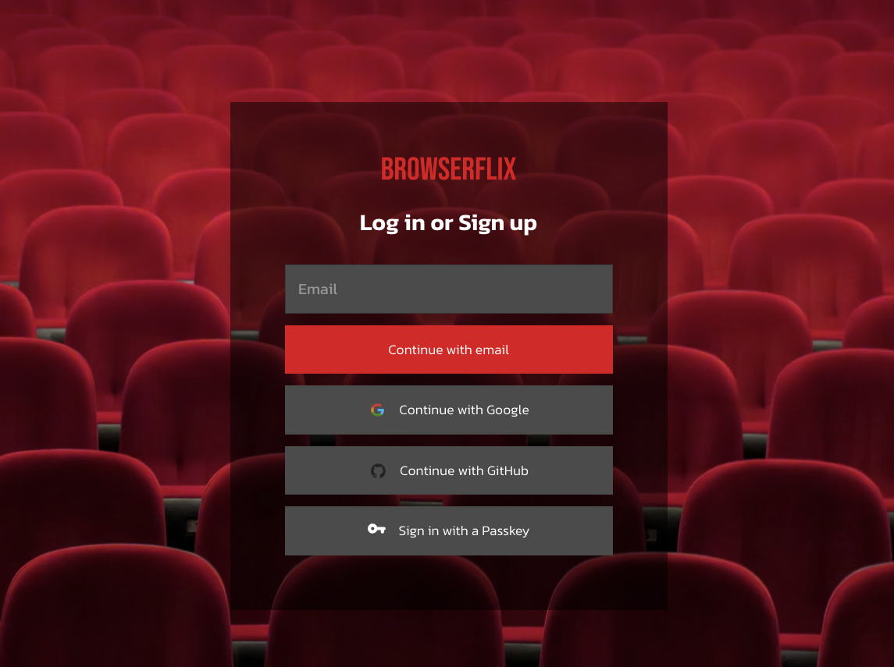
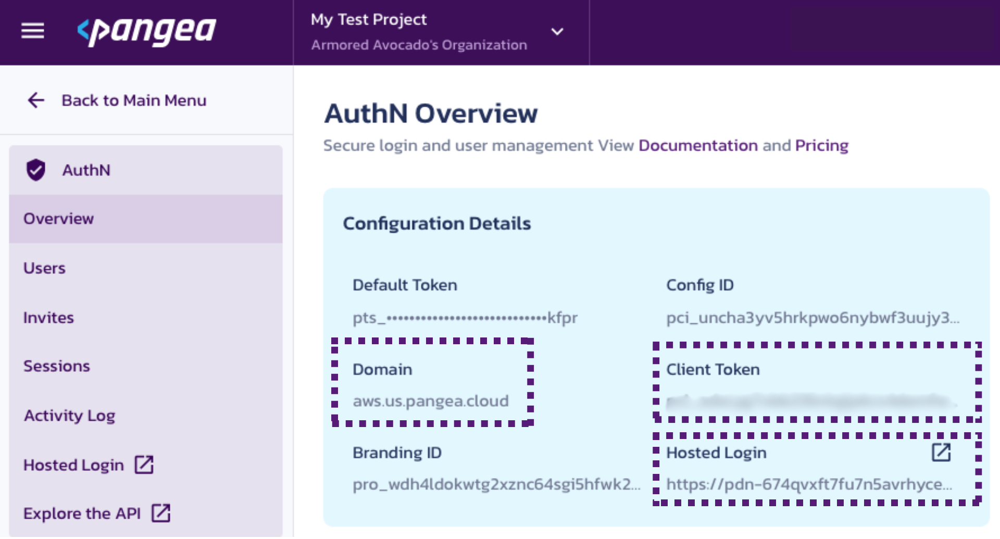
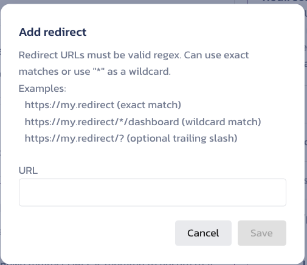

# Next.js Pangea AuthN Template (Page Router Mode)

This starter template demonstrates how to use the Pangea AuthN to your Next.js application (page router mode).
For step-by-step tutorial, check out our [blog post](https://pangea.cloud/blog/add-login-with-passkeys-to-nextjs-in-2-mins/?utm_source=github&utm_medium=nextjs-authn-template-page-router). 


## Pre Reqs Check
In order to run this application you are going to need:

* [pangea.cloud](https://pangea.cloud/services/authn?utm_source=github&utm_medium=nextjs-authn-template) account with AuhtN service

## Getting Started
### 1. Git clone this repo and checkout into the `page-router` branch.
```bash
git clone https://github.com/pangeacyber/pangea-integration-nextjs-authn.git
git checkout page-router
```

### 2. Rename .env.example into .env.local
```
mv .env.example .env.local
```

### 3. Copy AuthN tokens from Pangea AuthN Overview page into .env.local


### 4. Install packages and start your Next.js dev server
```
npm i
npm run dev
```

### 5. Add Authorized Redirect in Pangea Console.
In Pangea go to `AuthN > General > Redirect (Callback) Settings` and redirect to the copied host address and add /login_success to the end. Make sure to hit save. Most probably going to be `http://localhost:3000/login_success`



### 6. Head over to dev server
Visit your dev server (most probably `http://localhost:3000`) and the Next.js app should have Pangea AuthN successfully enabled.

If you have any questions or have trouble setting this up, feel free to raise an issue or reach out in the [Pangea Community](https://community.pangea.cloud/?utm_source=github&utm_medium=pangea-nextjs-authn-template).